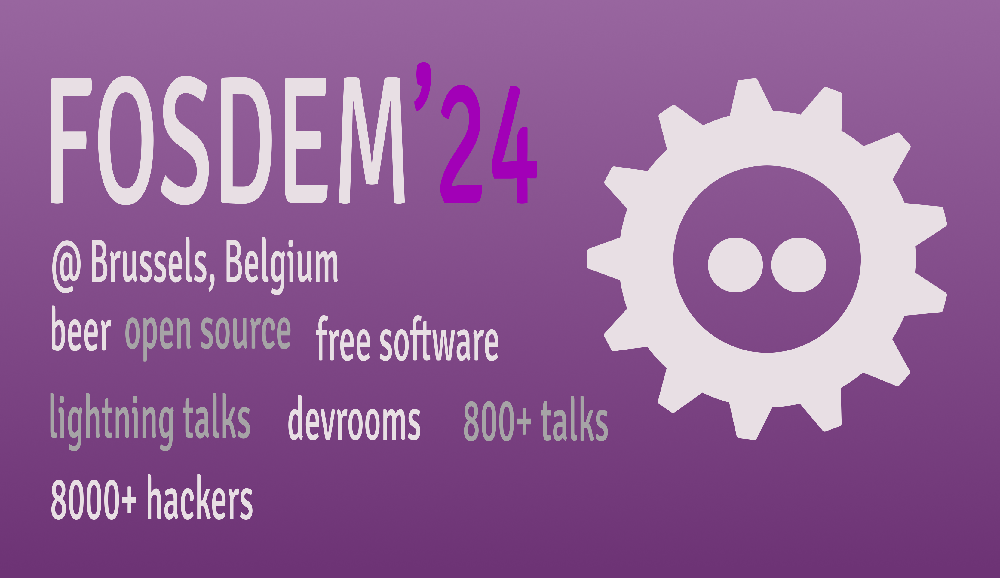

<picture>
  <source media="(prefers-color-scheme: dark)" srcset="docs/assets/images/cover-dark.png">
  <source media="(prefers-color-scheme: light)" srcset="docs/assets/images/cover-light.png">
  
</picture>


<div style="display: inline-block"  align="center">
	<h1>FOSDEM Event App - unofficial</h1>
	<p>
		
  		<a href="https://f-droid.org/en/packages/com.addhen.fosdem.android.app">

</a>
<br />
<a href="https://kotlinlang.org">

</a>

<a href="https://f-droid.org/en/packages/com.addhen.fosdem.android.app/">
</a>
<br />


</div>

[FOSDEM](https://fosdem.org/) is a free annual event held in **Brussels, Belgium** for software developers to meet, share ideas and collaborate.

This is a multi-platform client app to check the various sessions the event has to offer.

> Disclaimer: The name FOSDEM and the logo are registered trademarks of FOSDEM.


## ✍️ Author

👤 **Henry Addo**

* Twitter: <a href="https://twitter.com/eyedol" target="_blank">@eyedol</a>

## 📝 License

```
Copyright © 2024 - Addhen Limited and the FOSDEM Event app project contributors

Licensed under the Apache License, Version 2.0 (the "License");
you may not use this file except in compliance with the License.
You may obtain a copy of the License at

   http://www.apache.org/licenses/LICENSE-2.0

Unless required by applicable law or agreed to in writing, software
distributed under the License is distributed on an "AS IS" BASIS,
WITHOUT WARRANTIES OR CONDITIONS OF ANY KIND, either express or implied.
See the License for the specific language governing permissio
```